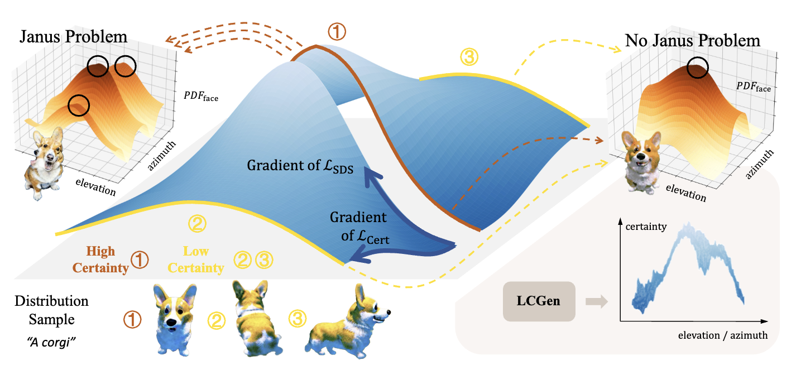

# LCGen
Paper Submitted to NeurIPS 2024

Code will be available if accepted

## Abstract
The Janus Problem is a common issue in SDS-based text-to-3D methods. Due to discrete view encoding and 2D diffusion prior guidance, the 3D representation model tends to learn content with higher certainty from each perspective, leading to spatial inconsistency. In this work, we first model and analyze the problem, visualizing the specific causes of the Janus Problem. Based on this, we further propose the LCGen method, which guides text-to-3D to obtain different certainty priors from various viewpoints, aiding in spatially consistent modeling. Experiments have proven that our LCGen method can be directly applied to different SDS-based text-to-3D methods, alleviating the Janus Problem without introducing additional information, increasing excessive training burden, or compromising the generation effect. Code will be available.

